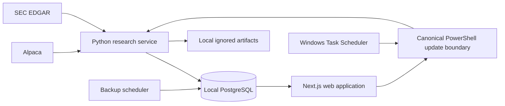

# Quantrade architecture

This document describes the **implemented local architecture**. The separately
accepted [hosted architecture ADR](docs/adr/0001-production-architecture.md) is a
proposal only; no hosted resource has been provisioned.

## Implemented system



### Runtime boundaries

- `apps/web`: Next.js 16 and React 19 server-rendered product pages,
  authenticated APIs, per-user watchlists, and the local update launcher.
- `services/research`: Python ingestion, normalization, features, datasets,
  experiments, scoring, portfolio maintenance, and model-health monitoring.
- `packages/contracts`: provider-neutral shared schemas.
- `infra/postgres/migrations`: ordered PostgreSQL schema changes.
- `scripts`: canonical setup, update, scheduling, backup, audit, and verification
  entry points.
- PostgreSQL: normalized point-in-time observations, security/user state,
  immutable research evidence, and operational ledgers.
- Local ignored storage: content-addressed historical artifacts, versioned
  datasets, model files, reports, logs, and verified backups.

The web process reads PostgreSQL directly. A local owner may launch the canonical
PowerShell update from the web, but the same command also runs independently from
the terminal or Windows Task Scheduler.

## Data and publication flow

```text
provider observation
  -> compact content-hashed receipt and retrieval metadata
  -> normalized point-in-time row
  -> decision-time availability filter
  -> versioned feature and sector percentile
  -> approved artifact validation
  -> immutable score, rank, and explanation
  -> portfolio/outcome and model-health monitoring
  -> authenticated read model
```

The daily path requests only missing market observations and discovers SEC
filings since the previous completed decision. It keeps filing metadata and
selected normalized facts for the approved 10-K, 10-Q, 20-F, 40-F, and 8-K
scope. Original SEC filing PDFs/HTML and routine provider response bodies are not
retained by the compact daily path.

## Time integrity

Every applicable record distinguishes:

- `observed_at`: when an observation occurred;
- `published_at`: when the source published it;
- `available_at`: the earliest permitted model-use time; and
- `ingested_at`: when Quantrade retrieved it.

Feature queries reject any record whose `available_at` exceeds `decision_at`.
Historical replay uses a versioned 8:00 p.m. Toronto cutoff. Live publication
sets its cutoff after current ingestion and validation, so data retrieved on a
retry cannot be backdated into an earlier failed attempt. SEC fundamentals use
filing acceptance and fact history rather than fiscal-period dates alone.

## Model path

The active model is `tier_b_monthly_elastic_net_sec_clean_v3`. It ranks a
500-name Tier-B current-survivor cohort from sector-percentile inputs and targets
20-session split-adjusted stock return relative to SPY. The artifact registers
six inputs; momentum, volatility, and liquidity have non-zero coefficients.

Raw model outputs order the eligible daily cross-section. Their percentile
positions become 0–100 display scores. The score is not a calibrated return,
probability, instruction, or guarantee. Explanations come from stored feature
contributions, not generated text.

## Durability and idempotency

- The daily orchestrator holds a PostgreSQL advisory lock.
- A durable run ledger and append-only events distinguish running, retrying,
  skipped, completed, partial, duplicate-prevented, and failed states.
- One canonical score publication may exist per date; completed evidence is not
  recalculated.
- Provider retries are bounded and limited to idempotent ingestion.
- Unfinished post-publication maintenance can resume without changing scores.
- Source, dataset, feature-registry, model, and decision artifacts are
  content-hashed and versioned.
- Data-quality failures block publication.
- Model changes require a new artifact, model card, validation evidence,
  approval decision, and append-only deployment event.

## Security boundary

The application is private by default. The first owner can be created only from
loopback. Sessions are database-backed; protected pages and APIs revalidate
them. State-changing requests require the correct origin, rate limits live in
PostgreSQL, watchlists are user-scoped, and audit events exclude credentials and
raw client addresses. Runtime secrets live only in ignored environment files.

## Proposed hosted boundary

The accepted design proposes a Render Next.js service, a separate durable Python
worker, managed PostgreSQL, Cloudflare R2, Clerk, and OpenTelemetry/Sentry. It
also replaces child-process web launches with idempotent queued jobs and leases.
This is **not implemented**. External operation remains blocked by market-data
rights, budget, and production security/recovery gates.

See [TECHNICAL_CASE_STUDY.md](TECHNICAL_CASE_STUDY.md) for the complete narrative
and measured evidence.
