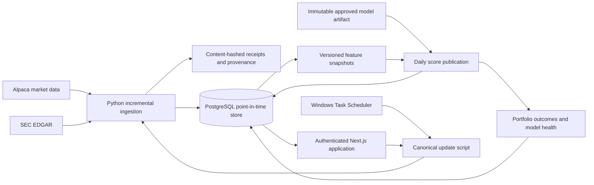

# Quantrade

Quantrade is a local, private quantitative-equity research platform. It combines
incremental market and SEC ingestion, point-in-time feature construction,
versioned model scoring, portfolio monitoring, and a polished Next.js interface
without presenting rankings as investment advice or guaranteed returns.

The project is deliberately more than a dashboard: every published score is
bound to a decision time, model artifact, feature registry, source lineage, and
immutable explanation. Failed updates stop before publication, repeated runs do
not duplicate scores, and unsuccessful model experiments remain part of the
research record.

> **Scope:** this repository is a zero-additional-budget portfolio project and a
> workstation-hosted private beta. A hosted architecture has been designed, but
> it is not deployed. Market-data rights have not been cleared for external
> display.

## What it demonstrates

- A Next.js 16 and React 19 research product backed by PostgreSQL.
- A Python 3.14 ingestion, feature, scoring, evaluation, and operations service.
- Point-in-time controls for market bars and SEC filings, including explicit
  `observed_at`, `published_at`, `available_at`, `ingested_at`, and decision-time
  boundaries.
- Content-hashed provenance, immutable model artifacts, append-only operational
  evidence, idempotent daily publication, and fail-closed data-quality checks.
- Purged chronological evaluation of a regularized linear ranker, plus preserved
  no-freeze decisions for challengers that did not clear registered gates.
- Authentication, per-user watchlists, same-origin mutation protection,
  database-backed rate limits, audit events, backups, restore rehearsal, and
  automated browser/accessibility coverage.
- A deterministic synthetic demo that requires no provider credentials or
  redistributed market data.

## Implemented local system



The web button, terminal command, and weekday scheduler all use the same
canonical update boundary. PostgreSQL advisory locking and same-date run records
prevent competing publications. Market ingestion requests only missing bars;
SEC discovery resumes from the last completed decision and deduplicates by
accession and content identity. The current compact daily path retains normalized
facts and small provenance records rather than original filing documents or
provider response bodies.

Read the full [technical case study](TECHNICAL_CASE_STUDY.md) for the system
design, data lineage, model protocol, measured results, failed experiments, and
the explicit boundary between implemented behavior and proposed infrastructure.
The reproducible final state is recorded in the
[portfolio release report](FINAL_PORTFOLIO_RELEASE.md) and annotated Git tag
`v1.0.0-portfolio.1`.

## Run the synthetic demo

Prerequisites are Windows 10/11, PowerShell 7, Node.js 22 with Corepack, Python
3.14, and local PostgreSQL 18. From a clean clone:

```powershell
Copy-Item .env.demo.example .env.demo
# Set only the local PostgreSQL password in .env.demo.
./scripts/bootstrap-demo.ps1
./scripts/run-demo.ps1 -SkipSetup
```

Open `http://localhost:3000`, create the local demo owner account, and follow the
persistent **Synthetic demo** label. The fixture uses generated values and
metadata-only provenance; provider-backed updates are disabled.

Run the complete reproducibility gate with:

```powershell
corepack pnpm --filter @quantrade/web exec playwright install chromium
./scripts/verify-reproducible-setup.ps1
```

Rehearse the real update contract without network access or writes:

```powershell
./scripts/run-daily-update.ps1 -EnvFile .env.demo -DryRun -ScoreDate 2026-08-28
```

See [REPRODUCIBLE_SETUP.md](REPRODUCIBLE_SETUP.md) for the complete setup and
fixture contract.

## Research model, stated honestly

The active private-beta model is `tier_b_monthly_elastic_net_sec_clean_v3`, an
elastic-net cross-sectional ranker trained on 15,561 monthly examples from
January 2022 through April 2025. It targets 20-session split-adjusted stock
return relative to SPY. Six features are registered; regularization left three
with non-zero coefficients: 12–1 momentum, 60-day volatility, and 20-day median
dollar liquidity.

The displayed 0–100 score is the stock's rank within the eligible daily
cross-section, not a calibrated return forecast. Development behavior is weak
and time-varying, and the July 2025–June 2026 holdout is already consumed. It is
reporting evidence only and cannot be reused to select another model. The
current-survivor cohort and static sectors make the history explicitly Tier B
and survivorship-biased; the project makes no unbiased historical-performance or
future-outperformance claim.

## Evidence snapshot

Measured on the private V1 release-candidate and portfolio-project baseline:

| Area | Evidence |
| --- | --- |
| Reproducibility | 39 migrations; 432 Python tests; 21 Playwright/accessibility tests; lint and production build passing |
| Research scale | 500-name fixed current-survivor cohort; 15,561 active-model training examples; 697,000 dated score snapshots in the measured local database |
| Operations | 48.45 s median and 97.31 s p95 daily update across ten completed September runs |
| Storage | 11.24 GiB PostgreSQL; 28.97 GiB retained repository data; more than 200 GiB projected free after backup steady state |
| Recovery and safety | Verified logical backup/restore, full Git-history secret scan, artifact-hygiene scan, hidden scheduled jobs, duplicate-safe publication |
| Evaluation discipline | Purged chronological folds, hash-bound datasets/artifacts, consumed-holdout guard, and three documented no-freeze model phases |

The dates and qualifications behind these figures are in
[V1_ACCEPTANCE_REPORT.md](V1_ACCEPTANCE_REPORT.md),
[LOCAL_OPERATING_FOOTPRINT.md](LOCAL_OPERATING_FOOTPRINT.md), and the
[technical case study](TECHNICAL_CASE_STUDY.md).

## Repository map

```text
apps/web/                  Next.js application, authenticated APIs, Playwright tests
services/research/         Python ingestion, research, scoring, monitoring, tests
packages/contracts/        Shared provider-neutral contracts
infra/postgres/migrations/ Ordered PostgreSQL schema migrations
scripts/                   Canonical setup, update, backup, audit, and verification commands
docs/adr/                  Architecture decisions, including the undeployed hosted design
data/derived/              Local ignored datasets, artifacts, and reports
```

## Design and operating documents

- [Technical case study](TECHNICAL_CASE_STUDY.md)
- [Final portfolio release](FINAL_PORTFOLIO_RELEASE.md)
- [Release and rollback runbook](RELEASE_RUNBOOK.md)
- [Reproducible local setup](REPRODUCIBLE_SETUP.md)
- [Current local architecture](ARCHITECTURE.md)
- [Canonical daily-update workflow](DAILY_UPDATE_WORKFLOW.md)
- [Research and evaluation protocol](EXPERIMENT_PROTOCOL.md)
- [Model health monitoring](MODEL_HEALTH_MONITORING.md)
- [Forward model evidence reporting](FORWARD_EVIDENCE_REPORTING.md)
- [Data-rights audit](DATA_RIGHTS_AUDIT.md)
- [Security boundary](WEB_SECURITY_BOUNDARY.md)
- [Recovery runbook](RECOVERY_RUNBOOK.md)
- [Authoritative roadmap](ROADMAP.md)

## Deployment boundary

The current application runs locally on one Windows workstation. The accepted
[hosted architecture ADR](docs/adr/0001-production-architecture.md) proposes a
separate web service, durable Python worker, managed PostgreSQL, object storage,
managed identity, and centralized observability. Those components are **design
work only**: no cloud resource is provisioned, no hosted beta is authorized, and
external display remains blocked until market-data rights and budget are
explicitly approved.

## Limitations

- Research only; no order execution, personalized advice, or return guarantee.
- Free-data Tier B history uses today's S&P 500 survivors and present-day sector
  groupings, not verified historical membership and classifications.
- The active model is sparse and its measured ranking signal is small and
  unstable across time blocks.
- The consumed holdout cannot support another round of model selection.
- Local workstation operation is recoverable but not highly available.
- Alpaca-derived prices, charts, ranks, baskets, and performance are not cleared
  for external display.
