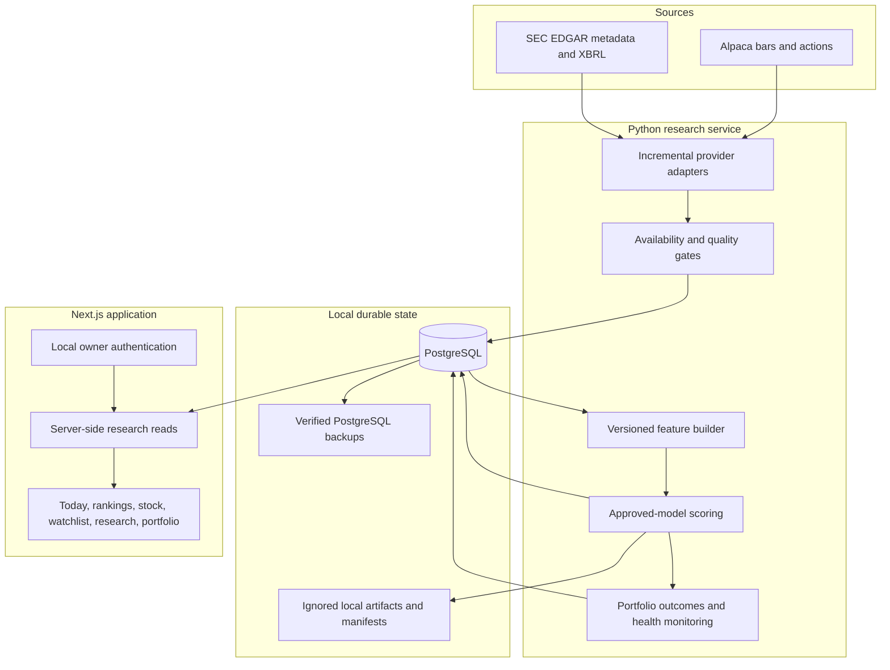
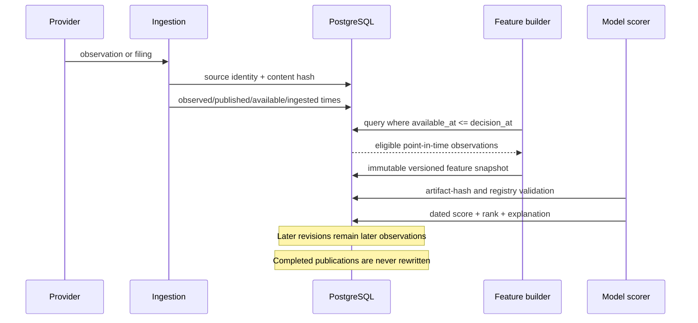
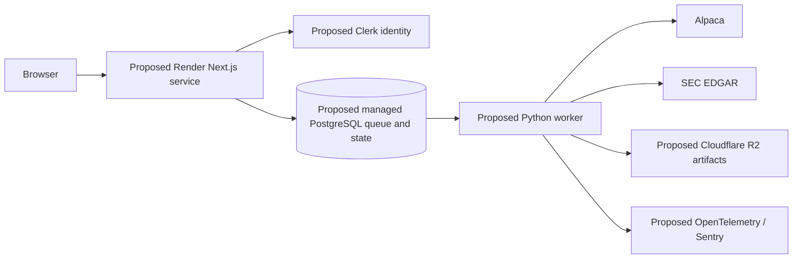

# Quantrade technical case study

**System state described:** private V1 release candidate and local portfolio
baseline, September 2026  
**Implemented environment:** one Windows workstation, local PostgreSQL, Next.js
web process, Python research process, Windows Task Scheduler  
**Product status:** private research application; no public deployment or trade
execution

## 1. The engineering problem

A stock ranking is easy to render and hard to defend. A credible research system
must answer questions that a chart alone cannot:

- What information was public when the score was formed?
- Can a retry alter an already published result?
- Which exact data, feature definitions, and model bytes produced a ranking?
- Does a backtest execute after the signal is available?
- What happens when a filing, bar, or portfolio outcome is missing?
- Can another developer run the product without receiving private data or
  credentials?

Quantrade was built around those questions. It presents a simple dark-mode
research product, but its primary technical work is the lineage and operational
system beneath the interface.

## 2. Scope and constraints

The working system covers a fixed 500-company research cohort based on the
current S&P 500 membership snapshot. This is intentionally labeled
`sp500_current_survivors_v1`, **not** historical S&P 500 membership. Current
sector classifications are also used historically. Both choices introduce
survivorship and classification bias, so the dataset is Tier B and suitable only
for private research.

The project uses free sources first:

- Alpaca Basic/IEX daily market bars and corporate actions;
- SEC EDGAR submissions, daily indexes, filing metadata, and XBRL facts; and
- SPY as the benchmark series.

It does not submit orders. It does not download original SEC filing PDFs or HTML
in the current daily workflow. It does not expose a public market-data API.

## 3. What is implemented today

### Runtime architecture



The Next.js application reads PostgreSQL server-side. Authentication uses a
local owner account, scrypt password hashes, opaque 12-hour sessions whose
SHA-256 digests are stored in the database, HTTP-only SameSite cookies, and an
authoritative database session check on every protected route. Watchlists are
scoped by user. Same-origin checks, database-backed rate limits, and append-only
sanitized audit events protect mutations.

The Python service owns provider access, normalization, features, experiments,
daily scores, portfolio bookkeeping, and model-health evidence. PostgreSQL holds
normalized observations and operational truth; ignored local files hold large
reproducible datasets, artifacts, manifests, and backups.

### One canonical update boundary

Terminal use, the web button, and the scheduler all invoke:

```powershell
./scripts/run-daily-update.ps1
```

The script launches one Python orchestrator. That orchestrator holds a
PostgreSQL advisory lock across ingestion and publication, uses a durable run
ledger, and permits one canonical score publication per date. A retry after
scores exist performs only unfinished maintenance; it does not recalculate or
duplicate scores.

The normal path is incremental:

1. Find the first missing market date after the latest stored SPY session.
2. Request only missing SPY and cohort bars plus relevant corporate actions.
3. Resume SEC daily-index discovery from the previous completed decision date,
   inclusive, so late same-day acceptances are caught.
4. Retain only the approved SEC form scope: 10-K, 10-Q, 20-F, 40-F, 8-K, and
   amendments.
5. Deduplicate filings by accession and source content; persist selected facts,
   filing identity, acceptance time, and compact provenance.
6. Validate the current regular session and set the live decision time only
   after ingestion and validation finish.
7. Build features, publish immutable scores and explanations, then separately
   progress portfolio and forward-outcome maintenance.

Transient provider failures receive bounded retries. Authentication errors,
invalid data, and unpublished SEC indexes fail immediately. A pre-publication
failure leaves no score set; a post-publication maintenance failure is reported
as “scores ready, maintenance pending” and can be resumed safely.

### Operational independence

Windows Task Scheduler runs a hidden weekday update at 10:15 p.m. Toronto time
and a PostgreSQL backup at 9:45 p.m. Codex and the browser do not need to be
open. The tasks reject overlaps, include guarded missed-run recovery, and write
local logs. Backups carry verification metadata and have passed an isolated
restore rehearsal.

## 4. Point-in-time data lineage

The central rule is simple: a historical decision may use only information whose
recorded availability precedes that decision.



Quantrade distinguishes:

- `observed_at`: when the economic or market observation occurred;
- `published_at`: when the source published it;
- `available_at`: the earliest time the research decision may use it; and
- `ingested_at`: when the local system retrieved it.

Historical market bars receive a conservative post-close availability time.
SEC records use the filing acceptance timestamp plus the registered safety
rules. Financial features resolve the latest eligible fact **as of** the decision
instead of joining on fiscal period alone. Historical replay uses a fixed 8:00
p.m. Toronto rule; live publication uses the actual time after current ingestion
and validation. Late data can help a later score but is never backdated into an
earlier one.

Raw identity and normalized rows are separately protected:

- content hashes and parser versions identify source receipts;
- provider/source/hash uniqueness prevents duplicate receipts;
- accession and observation keys prevent duplicate filings, facts, and bars;
- immutable manifests bind datasets to exact inputs and transformation versions;
- artifact hashes are rechecked before model loading; and
- database guards reject mutation of approved evidence, audit events, health
  snapshots, and published score history.

The modern daily path uses compact receipts: normalized values and provenance
are kept, while provider response bodies are not retained. Historical artifacts
remain local for reproducibility and are excluded from Git.

## 5. Features, model, and score contract

The active private-beta model is
`tier_b_monthly_elastic_net_sec_clean_v3`. It is a regularized linear
cross-sectional model with six sector-percentile inputs:

1. 12–1 momentum;
2. six-month relative strength;
3. 60-day trailing volatility;
4. 20-day median dollar liquidity;
5. trailing earnings yield; and
6. trailing return on assets.

The frozen elastic-net fit uses 15,561 examples across 40 monthly formations
from 2022-01-31 through 2025-04-30. Its target is the next 20-session
split-adjusted stock return minus the matching SPY return. Regularization set the
relative-strength, earnings-yield, and return-on-assets coefficients to exact
zero, leaving momentum, volatility, and liquidity active.

At daily scoring time, the model produces one raw linear prediction for every
eligible company. Quantrade orders those raw values and maps their cross-sectional
positions to 0–100. Therefore:

- 100 means “highest model rank in today's eligible cohort,” not a promised
  return;
- the raw percentage is not displayed as a calibrated expected return;
- missing non-zero inputs make a company ineligible; and
- exact-zero inputs may be absent under the versioned live eligibility contract.

Each stock explanation is calculated from the stored standardized feature
contributions. No LLM generates score evidence.

## 6. Training and evaluation without time travel

### Chronological protocol

Random row splitting would leak future market regimes and overlapping labels.
Quantrade uses chronological folds. Training rows must finish their 20-session
outcome before the next validation block begins. The active model's development
validation used four outer blocks:

| Validation block | Purged training ends | Validation observations | Mean monthly rank IC |
| --- | --- | ---: | ---: |
| Jul–Dec 2023 | May 2023 | 2,692 | -0.0195 |
| Jan–Jun 2024 | Nov 2023 | 2,728 | 0.0346 |
| Jul–Dec 2024 | Jun 2024 | 2,749 | 0.0465 |
| Jan–Apr 2025 | Nov 2024 | 1,843 | -0.0936 |

Across those 10,012 validation predictions, equal-month mean rank IC was
-0.0002, the mean 25-bp Top-20 relative-return diagnostic was +0.0028 per
formation, and mean one-way turnover was 0.395. These are development
diagnostics—not deployment returns—and they show why the model is described as
weak and regime-dependent rather than accurate in a percentage sense.

This development-only validation was reconstructed after the historical holdout
had already been consumed. It replayed the frozen specification without using
holdout rows and did not tune or alter the artifact, but it is governance
evidence rather than pristine pre-holdout model-selection evidence.

### Holdout boundary

July 2025 through June 2026 was the locked reporting period. It has now been
consumed and was also exposed during subsequent repair work. The repository
therefore treats it as reporting evidence, not a pristine reusable test set. It
cannot be used to select, tune, or calibrate another candidate.

The historical cohort is also survivorship-biased. Consequently, neither the
holdout nor the project as a whole supports an unbiased public performance
claim. New model work is deferred until genuinely untouched forward outcomes or
materially new data can support a credible comparison.

### Portfolio semantics

Official model portfolios are formed only at the last observed regular session
of a calendar month. The top 20 eligible scores receive equal 5% target weights.
Execution is simulated at the next eligible session open, never the signal-day
close. Outcomes require 20 completed sessions and use corporate-action-aware
prices, SPY comparison, turnover, and explicit one-way cost cases. Missing
windows remain pending, withheld, or missed; they are not repaired with future
knowledge.

## 7. Negative results are first-class output

The research history contains several ideas that looked plausible and failed
registered gates:

| Experiment | Result |
| --- | --- |
| Amihud illiquidity | Rejected as redundant with median dollar volume; median absolute correlation 0.9135 exceeded the 0.90 ceiling. |
| 20-day reversal | Rejected for unstable ranks and 0.95 median Top-20 turnover. |
| Robust Huber, boosted stumps, pairwise ranker | No candidate improved the active reference across ranking, stability, spread, and cost gates. |
| SPY-regime interactions | Lower overall and range-bound rank IC; five registered gates failed. |
| Six-family weekly ridge repair | Equal-month rank IC 0.0060 versus 0.0188 for the refit monthly elastic-net family on the same 44,230 matched predictions. |
| Anchored accounting-residual ridge | Mean monthly rank IC improved only +0.00079 over its anchor; robustness, paired portfolio, turnover, and coefficient-direction gates failed. |

The Phase 9D candidate produced a 0.02030 mean monthly rank IC, but the
improvement interval crossed zero and the registered decision was `no-freeze`.
The active deployment did not change. This is intentional: reproducible failure
is more credible than repeatedly tuning until one backtest looks attractive.

Detailed decisions are preserved in
[REJECTED_HYPOTHESES.md](REJECTED_HYPOTHESES.md),
[MODEL_EVALUATION_REPAIR_RESULTS.md](MODEL_EVALUATION_REPAIR_RESULTS.md), and
[PHASE_9D_READINESS_DECISION.md](PHASE_9D_READINESS_DECISION.md).

## 8. Measured system results

The following measurements describe engineering evidence, not investment
performance:

| Measurement | Result | Evidence date / qualification |
| --- | ---: | --- |
| Ordered schema migrations | 39 | V1 acceptance, 2026-09-14 |
| PostgreSQL tables after clean migration | 57 | Disposable acceptance database |
| Research tests | 432 passing | Independent reproduction gate, 2026-09-16 |
| Browser/accessibility tests | 21 passing | 1280, 390, and 320 px coverage |
| Current research cohort | 500 names | Fixed Tier-B current survivors |
| Eligible live snapshots | 496 / 500 | Acceptance snapshot, 2026-09-14; exclusions explicit |
| Database size | 11.24 GiB | Local capacity measurement, 2026-09-16 |
| Retained repository data | 28.97 GiB | Raw, derived, backups, and logs |
| Daily update latency | 48.45 s median; 97.31 s p95 | Ten completed Sep 1–15 runs |
| Verified restore | Passed | 57 tables restored to an isolated database |
| Current compact receipts | 887, all payload-free | Provenance retained; response bodies discarded |

Acceptance also passed the full Git-history secret scan, tracked-artifact scan,
storage-retention dry run, scheduler verification, portfolio-integrity audit,
web lint, and production build.

## 9. Independent reproduction

The reviewer path uses a deterministic synthetic database so the application can
be inspected without private provider data, secrets, or the owner's database.

```powershell
Copy-Item .env.demo.example .env.demo
# Set only the local PostgreSQL password in .env.demo.
./scripts/bootstrap-demo.ps1
./scripts/run-demo.ps1 -SkipSetup
```

The bootstrap installs locked dependencies, creates only a lowercase local
database ending in `_demo`, applies all 39 migrations, and loads the versioned
`quantrade_synthetic_demo_v1` fixture. Demo mode remains visibly labeled and
blocks provider-backed update launches in both the UI and API.

Run every reviewer gate with:

```powershell
corepack pnpm --filter @quantrade/web exec playwright install chromium
./scripts/verify-reproducible-setup.ps1
```

Inspect the production-shaped update plan without provider calls or writes:

```powershell
./scripts/run-daily-update.ps1 -EnvFile .env.demo -DryRun -ScoreDate 2026-08-28
```

See [REPRODUCIBLE_SETUP.md](REPRODUCIBLE_SETUP.md) for prerequisites and exact
fixture guarantees.

## 10. Implemented versus proposed production architecture

The following boundary is strict.

| Capability | Implemented locally | Proposed, not deployed |
| --- | --- | --- |
| Web runtime | Next.js process on the Windows workstation | Render Next.js service in Ohio |
| Research runtime | Local Python process launched by canonical PowerShell | Separately deployable containerized Python worker |
| Long-running jobs | PostgreSQL advisory lock, run ledger, Windows scheduler | PostgreSQL durable queue with leases and `SKIP LOCKED` |
| Database | Local PostgreSQL with scheduled logical backups | Managed PostgreSQL with PITR and private networking |
| Artifacts | Ignored local content-hashed files and manifests | Cloudflare R2 immutable object storage |
| Identity | Single local owner account | Clerk-managed invited-user identity |
| Observability | Local structured progress, ledgers, logs, and health views | OpenTelemetry and Sentry traces/errors |
| Availability | Recoverable single workstation | Separate web/worker lifecycle with durable retry |



This architecture is an accepted design exercise only. No cloud resource has
been provisioned. External beta remains blocked until written market-data
display/derived-use rights, budget, security review, recovery objectives, and
operating ownership are approved. See
[ADR 0001](docs/adr/0001-production-architecture.md) and
[DATA_RIGHTS_AUDIT.md](DATA_RIGHTS_AUDIT.md).

## 11. Tradeoffs and lessons

- **Truthful scope beats a larger backtest.** A current-survivor cohort can
  support engineering and private research, but not unbiased index-history
  claims.
- **Availability time is a schema concern.** Preventing leakage requires stored
  timestamps, query gates, and immutable manifests—not a comment in a notebook.
- **Publication and maintenance are different states.** Scores can be valid
  while a later portfolio task needs retry; collapsing both into “success” loses
  operational truth.
- **Sparse linear models can still be useful software artifacts.** They are fast,
  interpretable, and easy to reproduce, but a rank score must not be presented as
  a calibrated return.
- **Negative experiments reduce risk.** Frozen protocols and no-freeze records
  prevent complexity from being promoted because of one attractive period.
- **A local system can still be professionally operated.** Canonical commands,
  locks, idempotency, backup/restore tests, secret scans, and synthetic fixtures
  create a credible engineering boundary without paid infrastructure.

## 12. Known limitations

1. The 500-name history is survivorship-biased and uses current static sectors.
2. The active model's ranking signal is small and unstable across development
   blocks; three of six registered inputs have exact-zero coefficients.
3. The historical holdout is consumed and cannot serve future model selection.
4. The workstation is a single availability domain despite tested recovery.
5. The synthetic demo proves application behavior, not provider integration or
   investment performance.
6. Alpaca-derived external display and hosted storage remain blocked pending
   explicit rights.
7. No result in this repository guarantees that a stock or basket will
   outperform SPY.
